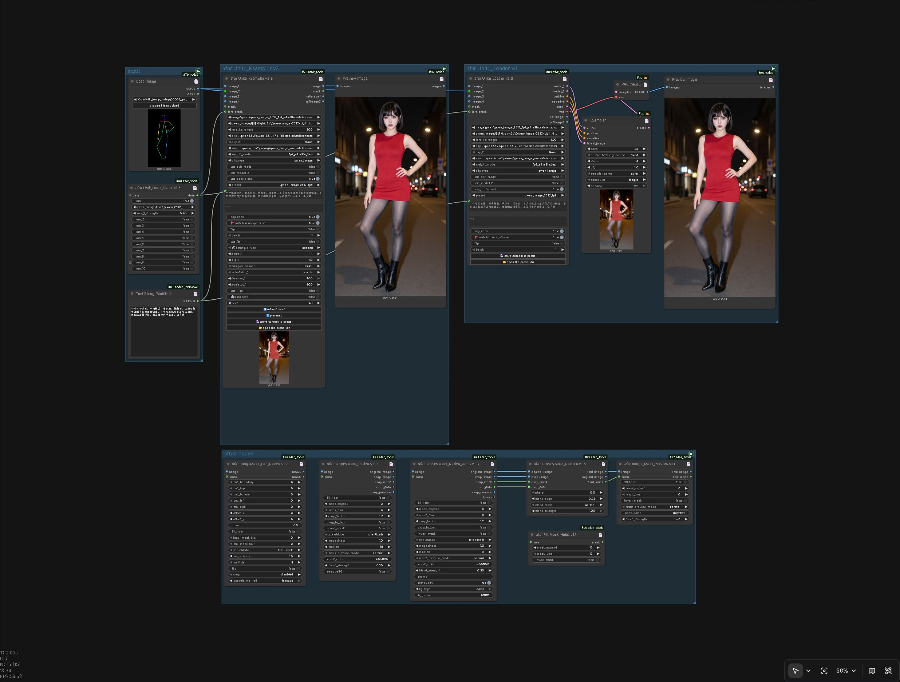

[🇨🇳 中文](./README.md) | [🇬🇧 English](./README-EN.md)
# afarTools - ComfyUI 综合插件包

> **当前版本**：v3.3 

`afarTools` 是一款专为 ComfyUI 打造的自研综合插件包。通过高度集成的核心节点，极大地简化了从模型加载、参数配置到图像编辑的复杂工作流，致力于为用户提供一站式、高效率的生图与修图体验。
<p align="center">
  
</p>

---

## 🧩 节点介绍

### 🌟 主要节点
| 节点名称 | 功能描述 |
| --- | --- |
| **Unite_Ksampler** | **综合核心节点**。一站式集成模型加载、参数配置、采样控制、参考图编辑、LoRA 管理等流程功能，实现单节点完成全流程生图、图像编辑工作流。 |
| **Unite_Loader** | **Unite_Ksampler 的拆解版**。将 Ksampler 采样逻辑分离，提供更灵活的模块化组合。 |
| **Until_Loras_Stack** | **LoRA 堆叠加载器**。专为配合 `Unite_Ksampler` / `Unite_Loader` 设计的 LoRA 管理节点。 |

### 🛠️ 其它实用节点
| 节点名称 | 功能描述 |
| --- | --- |
| **CropByMask_Resize** | 裁切并缩放。支持手动框选和自动识别 Mask 进行裁切。 |
| **CropByMask_Restore** | `CropByMask_Resize` 的贴回节点。支持设置叠加模型，将处理后的图像完美还原。 |
| **CropByMask_Resize_sam3** | `CropByMask_Resize` 的升级版。加入 SAM3 语义识别功能，实现更精准的自动裁切。 |
| **ImageMask_Pad_Resize** | 图片扩展 (Pad) 或缩放 (Resize) 的综合处理节点。 |
| **Fill_Mask_Holes** | 简单的 Mask 填充节点，用于修复 Mask 中的空洞。 |
| **Image_Mask_Preview** | Image 和 Mask 叠加预览节点。支持 Mask 模糊、扩展等简单处理并实时输出预览。 |

---

## 🚀 适配模型

本插件经过深度优化，完美兼容以下主流模型系列：

- **🤖 通义千问系列**：Qwen Image 2512、Qwen Image Edit 2509/2511、FireRed Edit
- **🌊 Flux 系列**：Flux1.dev、Chroma、Flux2、Flux2 Klein、Ernie
- **🎨 传统 SD 系列**：SD1.5、SDXL、Illustrious、Noodai、Pony
- **⚡ Zimage 系列**：Zimage Base、Zimage Turbo
- **📦 AIO 整合大模型**：常规 Checkpoint 模型、打包式 AIO 全量模型

---

## 💡 核心亮点功能

### 1. 双大模型加载系统
- **独立启停**：通过 `use model2` 开关控制双模型独立加载与运行。
- **二重采样**：支持 Advance Double 同类型双模型二重采样管线。
- **智能覆盖**：Clip/VAE 覆盖逻辑，当大模型自带 clip/vae 时，优先使用大模型自身的组件。
- **独立 LoRA 绑定**：lora1 绑定模型1、lora2 绑定模型2，精准定位加速 LoRA。（*更多 LoRA 扩展可外接 `loras stack` 节点*）

### 2. 参考图适配
- **动态展开**：参考图尺寸匹配开关默认冻结隐藏，传入参考图后自动展开。
- **自动对齐**：开启后，Latent 尺寸自动对齐参考图 1。
- **自由定义**：关闭后，可自由自定义输出分辨率。

### 3. 预设系统
- **全参数保存**：模型、CLIP、VAE、ControlNet、步数、采样器等所有参数均可保存为预设，支持一键加载。
- **提示词专属预设**：小巧门 🔑 —— 通过 `_p` 或 `_prompt` 前缀命名文件，加载时仅覆盖正负提示词。
- **快捷管理**：内置预设文件夹打开按钮，方便快速修改、删除预设模板。

### 4. 种子控制
- 替代官方原生种子功能，操作更直观。
- **状态切换**：默认锁定状态，开启即为随机模式。
- **便捷操作**：支持手动输入、一键刷新、一键回退上一次种子参数。

### 5. ControlNet / Edit 双模式互斥机制
- **模式互斥**：生图 CN 模式与图像编辑模式二选一（大多编辑模型自带参考能力，无需叠加 CN）。
- **广泛支持**：目前支持常规 CN 和 Model Patch（Zimage）模型。
- **输入逻辑**：
  - **Edit 模式**：`image1` - `image4` 均为正常顺序参考图。
  - **ControlNet 模式**：开启后，`image2` 为参考图。
  - **Zimage 类型**：`image2` 为参考图，`image3` 为 Inpaint 参考图。

### 6. 格式支持
- 支持 `gguf`, `safetensors`, `pt`, `ckpt` 等主流模型格式。

---

## 📥 安装方式

### 方式一：Git 克隆安装（推荐）
打开终端（Terminal / CMD），进入 ComfyUI 的 `custom_nodes` 目录，执行以下命令：
```bash
cd ComfyUI/custom_nodes
git clone https://github.com/你的用户名/ComfyUI-afarTools.git
```
*重启 ComfyUI 即可正常使用。*

### 方式二：手动安装
1. 点击 GitHub 仓库页面的 **Code** -> **Download ZIP** 下载项目压缩包。
2. 解压压缩包，将解压后的文件夹重命名为 `ComfyUI-afarTools`（或保持原名）。
3. 将该文件夹放入 ComfyUI 根目录下的 `custom_nodes` 文件夹中。
4. 重启 ComfyUI 即可。

### 注意：相关依赖事项
1. 插件支持检索gguf格式的文件，依赖gguf插件中的pig文件，所以需要存在或先安装gguf插件：https://github.com/calcuis/gguf
2. 在CropByMask_Resize，CropByMask_Resize_sam3节点中会使用到opencv-python库，大多插件其实已经提前安装，若没有也可以自己手动安装一下。进入自己的python环境中pip install opencv-python即可。其实不安装，节点也能使用，只是效率和遮罩结果会远不如有opencv-python包的支持。若没有安装，建议安装。

---

## 📝 更新日志

- **v3.3** (当前版本)：发布 afarTools 综合插件包，包含 Unite_Ksampler 核心节点、双大模型加载系统、SAM3 语义识别裁切、全参数预设系统等核心功能。

---

## 🤝 支持与反馈

如果您在使用过程中遇到任何问题，或有更好的功能建议，欢迎在 GitHub 提交 **Issue** 或 **Pull Request**！